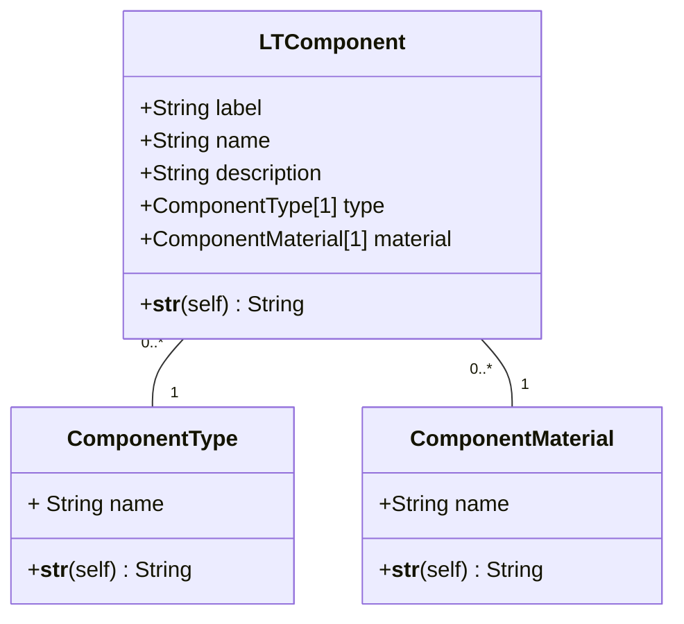

# Methodological_company_business_process_automation
An attempt to analyze the business processes of a company that develops STEM courses for children. The purpose of the work is to create a technical task for the design of a software product that can digitize and automate business processes. This solution should improve the company's performance: facilitate and speed up the work of employees, eliminate the possibility of common mistakes, simplify the collection of statistics and analysis of the company's work.

